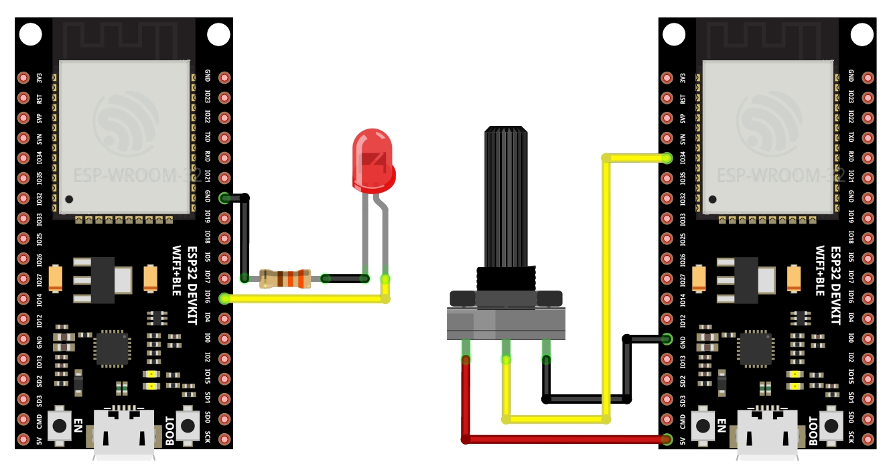

# BLEServer

Communication between two ESP32 via Bluetooth making use of the BLEServer library.

I used UUID characteristics to send and receive data.

The server side reads and process potentiometer data and sends it to the client side throughout Bluetooth Low Energy.

